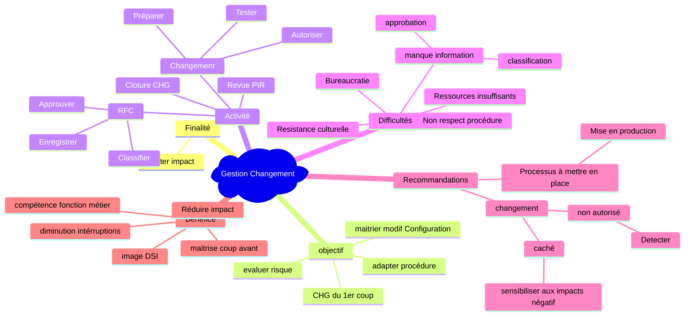
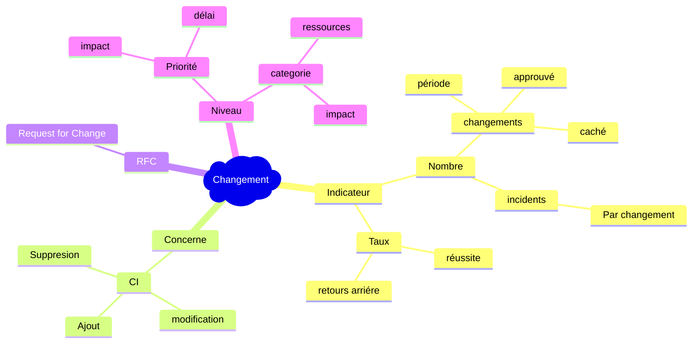

```mermaid
mindmap
  root)Gestion Changement(
        Finalité
            limiter impact
        objectif
            maitrier modif Configuration
            evaluer risque
            adapter procédure
            CHG du 1er coup
        Activité
            RFC
                Enregistrer
                Classifier
                Approuver
            Changement
                Préparer
                Tester
                Autoriser
            Revue PIR
            Cloture CHG
        Difficultés
            Bureaucratie
            Resistance culturelle
            Non respect procédure
            Ressources insuffisants
            manque information
                classification
                approbation
        Recommandations
            Processus à mettre en place
                Mise en production
            changement
                caché
                    sensibiliser aux impacts négatif
                non autorisé
                    Detecter
        Bénéfice
            Réduire impact
            maitrise coup avant
            compétence fonction métier
            diminution intérruptions
            image DSI
```

```mermaid
mindmap
  root)Changement(
        Indicateur
            Nombre
                changements
                    période
                    approuvé
                    caché
                incidents
                    Par changement
            Taux
                réussite
                retours arriére
        Concerne
            CI
                Ajout
                modification
                Suppresion
        RFC
            Request for Change
        Niveau
            Priorité
                impact
                délai
            categorie
                impact
                ressources
```
