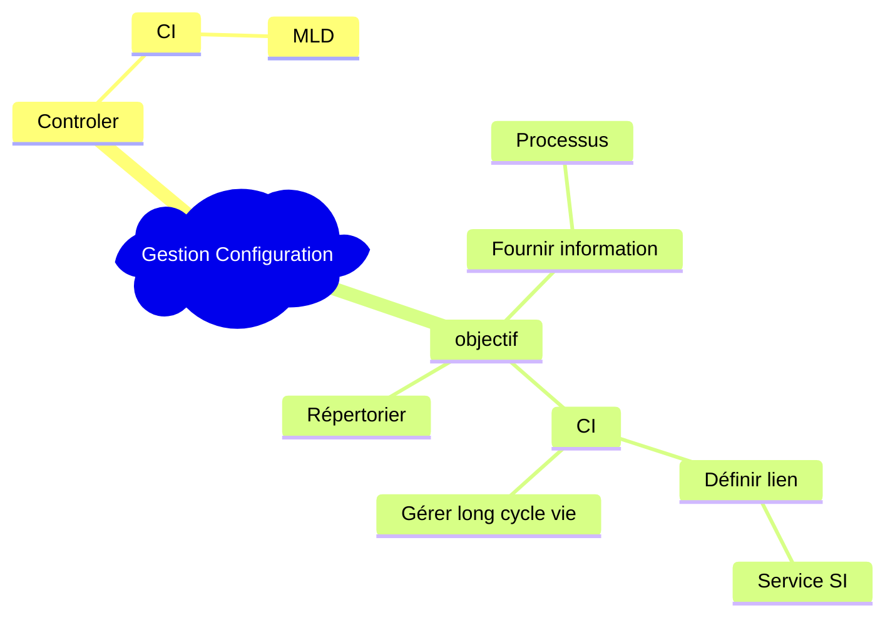
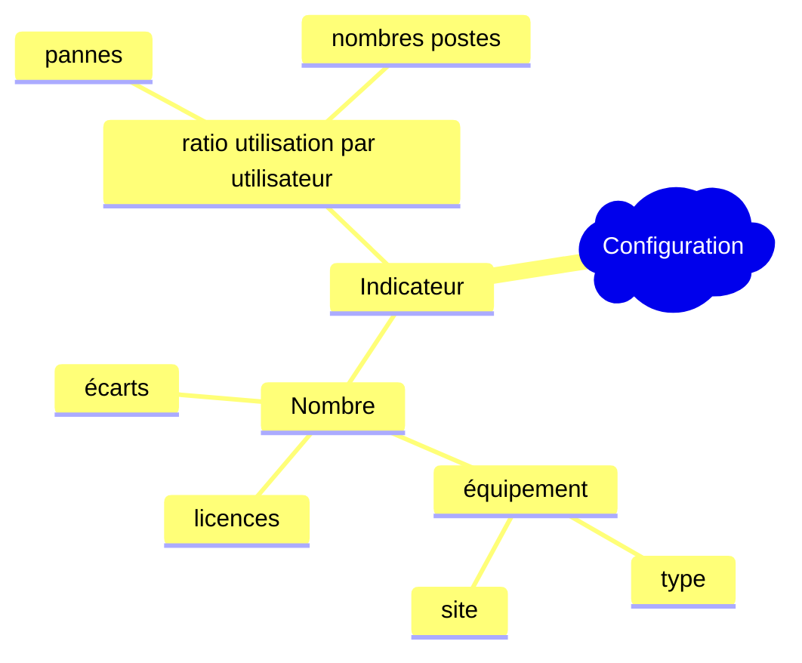

```mermaid
mindmap
  root)Gestion Configuration(
        Controler
            CI
                MLD
        objectif
            CI
                Définir lien
                    Service SI
                Gérer long cycle vie
            Répertorier
            Fournir information
                Processus
        
```

```mermaid
mindmap
  root)Configuration(

        Indicateur
            Nombre
                équipement
                    type
                    site
                licences
                écarts
            ratio utilisation par utilisateur
                pannes
                nombres postes
```
