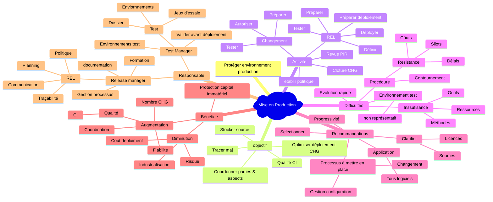
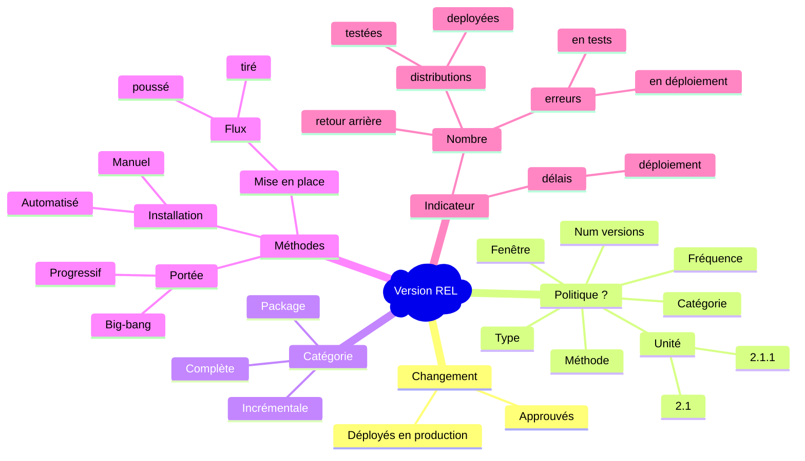

```mermaid
mindmap
  root)Mise en Production(
        Protéger environnement production
        objectif
            Qualité CI
            Optimiser déploiement CHG
            Coordonner parties & aspects
            Tracer maj
            Stocker source
        Activité
            etablir politique
            REL
                Définir
                Préparer
                Tester
                Préparer déploiement
                Déployer
            Changement
                Préparer
                Tester
                Autoriser
            Revue PIR
            Cloture CHG
        Difficultés
            Evolution rapide
            Procédure
                Resistance
                    Côuts
                    Silots
                    Délais
                Contournement
            Inssufisance
                Outils
                Méthodes
                Ressources
            Environnement test
                non représentatif
        Recommandations
            Processus à mettre en place
                Changement
                Gestion configuration
            Clarifier
                Sources
                Licences
            Application
                Tous logiciels
            Progressivité
            Selectionner
        Bénéfice
            Augmentation
                Nombre CHG
                Coordination
                Fiabilité
                Qualité
                    CI
            Protection capital immatériel
            Diminution
                Risque
                Cout déploiment
                Industrialisation
        Responsable
            Release manager
                Gestion processus
                REL
                    Politique
                    Planning
                    Traçabilité
                    Communication
                Formation
                documentation
            Test Manager
                Environnements test
                Test
                    Enviornnements
                    Dossier
                    Jeux d'essaie
                Valider avant déploiement
                
```

```mermaid
mindmap
  root)Version REL(
        Changement
            Approuvés
            Déployés en production
        Politique ?
            Fréquence
            Fenêtre
            Unité
                2.1
                2.1.1
            Num versions
            Catégorie
            Type
            Méthode
        Catégorie
            Complète
            Incrémentale
            Package
        Méthodes
            Portée
                Big-bang
                Progressif
            Mise en place
                Flux
                    poussé
                    tiré
            Installation
                Manuel
                Automatisé

        Indicateur
            Nombre
                distributions
                    testées
                    deployées
                erreurs
                    en tests
                    en déploiement
                retour arrière
            délais
                déploiement
```
