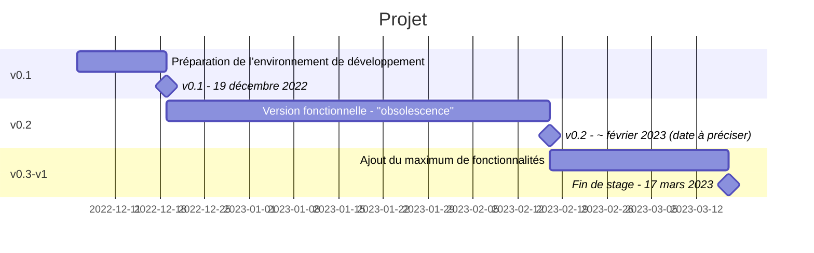

# Mermaid

Mermaid permet de réaliser des diagrammes en Markdown.

<https://github.com/mermaid-js/mermaid>

## Exemple

### Diagramme Gantt

```markdown
``mermaid
gantt
    title Projet
    dateFormat  YYYY-MM-DD
    section v0.1
    Préparation de l’environnement de développement :a1, 2022-12-05, 2022-12-19
    v0.1 - 19 décembre 2022 : milestone, m1, 2022-12-19,
    section v0.2
    Version fonctionnelle - "obsolescence" :2022-12-19, 2023-02-17
    v0.2 - ~ février 2023 (date à préciser) : milestone, m1, 2023-02-17,
    section v0.3-v1
    Ajout du maximum de fonctionnalités :2023-02-17, 2023-03-17
    Fin de stage - 17 mars 2023 : milestone, m1, 2023-03-17,
``
```


