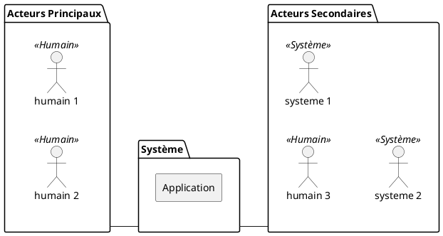

# PlantUML

PlantUML permet de réaliser l'ensemble des diagrammes UML en textuelle : <https://plantuml.com/fr/>

Documentation :

- <https://plantuml.com/fr/commons>

## Exemple

### Diagramme de contexte

fichier ".puml" :

## Compilateurs

### Visual Studio Code

Utiliser l'extension **PlantUML** de *jebbs* : <https://marketplace.visualstudio.com/items?itemName=jebbs.plantuml>
